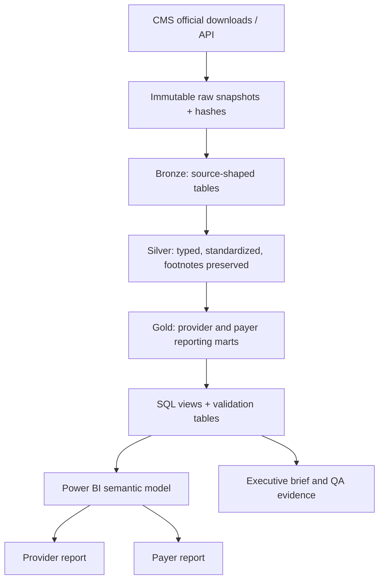

# Provider / Payer Quality Reporting Portfolio Project

> 新 Project 窗口启动文件  
> 为 Yiqian Huang 的医疗数据分析求职作品集设计  
> 外部资料核对日期：2026-07-29  
> 建议项目名称：**US Healthcare Quality Performance Reporting**

---

## 0. 给新 Project 窗口的执行指令

请先完整阅读本文件，再开始创建或修改任何代码。

这个项目的目标不是快速拼出一个 Power BI 页面，而是完成一个可复现、可验证、可解释的医疗质量报告项目，证明候选人能够完成真实 JD 中反复出现的工作：

1. 理解 Provider 与 Payer 的业务区别；
2. 从官方来源获取并记录数据版本；
3. 用 SQL/Python/Power Query 清洗和建模；
4. 定义指标、方向、分母、测量期和解释边界；
5. 对缺失、重复、脚注、异常值、schema drift 和 join 结果做 QA；
6. 建立 Power BI star schema 与显式 DAX measures；
7. 用州、全国或同类机构基准解释结果；
8. 把结果转化成运营或质量改进建议，而不是只展示图表。

### 新窗口开始后必须先做

1. 确认这是一个**新仓库/新项目**，不要直接覆盖现有的  
   `C:\Users\10619\behavioral-health-resource-analysis`。
2. 重新打开并验证本文件中所有官方数据链接，因为 CMS/雇主页面会更新。
3. 先建立 `source_inventory.md`，记录每个数据集的：
   - 官方名称；
   - 数据集 ID；
   - 下载 URL；
   - 下载日期；
   - source modified/released date；
   - 测量期；
   - 文件大小与 SHA-256；
   - 行数、列数与主键候选；
   - 数据字典链接。
4. 先完成 **Provider MVP**，通过 QA 后再做 Payer 模块。
5. 不得把公开汇总数据称为 patient-level data、claims extract、EHR extract 或真实生产数据。
6. 不得把自定义指标称为正式 HEDIS、CMS、NCQA 或 AHRQ 指标。
7. 如果创建 synthetic member-level gap 数据，必须在文件名、README、Dashboard 和简历材料中同时标明 `synthetic`。
8. 在项目完成前不要写带具体成果数字的简历 bullet；最终 bullet 必须来自实际运行结果。

### 候选人事实来源

- 主求职档案：  
  `C:\Users\10619\Documents\Codex\2026-07-14\linkedin-git-c-users-10619-behavioral-2\outputs\job_applications_this_thread.md`
- 现有作品集：  
  `C:\Users\10619\behavioral-health-resource-analysis`

若本文件与主求职档案发生候选人事实冲突，以主求职档案为准。

---

## 1. 项目结论：不要再做一个泛化的 Hospital Dashboard

最有求职价值的版本是一个包含两个层次的质量报告作品：

### 核心模块：Provider Quality Performance

使用真实 CMS Hospital Care Compare / Provider Data Catalog 数据，回答：

- 哪些医院或州在 readmission、patient experience、safety 和 value-based purchasing 指标上需要进一步 review？
- 某医院相对于州、全国或同类医院的表现如何？
- 哪些变化可能是数据刷新、测量期、脚注或 sample-size 问题，而不是业务表现变化？
- 在向管理层展示结果前，报告是否通过完整性、唯一性、范围和 reconciliation 检查？

### 扩展模块：Payer Quality Performance

使用真实 CMS Medicare Advantage / Part D Star Ratings 与 enrollment 汇总数据，回答：

- 某 contract 在哪些 measure/domain 上相对较弱？
- 哪些 measure 的表现或 star rating 出现年度变化？
- 在结合 enrollment 后，哪些 contract/measure 更值得优先 review？
- 哪些结论只能做到 contract-level benchmarking，不能被解释成 member-level gap closure？

### 可选模块：Synthetic Gap Closure Workflow

只有在 Provider 和 Payer 官方汇总模块完成后，才考虑生成一个小型 synthetic member-level 数据集，用于展示：

- eligible population；
- numerator compliance；
- open care gaps；
- provider assignment；
- outreach status；
- gap closure；
- pre/post intervention monitoring。

这个模块展示的是**工作流能力**，不是正式 HEDIS 结果，也不代表真实患者或保险理赔数据。

---

## 2. 为什么这个项目与真实 JD 对齐

以下岗位材料显示，医疗质量分析并不只是“做 Dashboard”，而是要求完整的 reporting lifecycle。

| 真实岗位 | 反复出现的工作 | 本项目应提供的证据 |
|---|---|---|
| Molina — Analyst, Health Plan Risk & Quality Reporting | 自定义 quality reports、provider outreach、gap closure、HEDIS/quality QA、claims/pharmacy/lab 数据、SQL、Power BI、Excel、异常与 root-cause analysis、逻辑变更前后测试 | Payer measure benchmarking、QA results、logic versioning、异常调查记录、可选 synthetic gap workflow |
| Molina — Analyst, Data & Analytics | recurring/ad hoc reporting、SQL/Excel/BI、utilization/cost/operational data、regulatory reporting、需求收集、数据准确性与一致性 | Provider/Payer reporting marts、requirements document、validation suite、stakeholder-ready dashboard |
| MVP Health Care — Quality Data Analyst | quality improvement、gap analysis、patient engagement、dashboard、data integrity、data governance、SQL/Power BI/Python/R | Payer quality priorities、治理文件、可追溯指标字典、QA 与 synthetic gap extension |
| Pullman Regional Hospital — Clinical Quality Data Analyst | CMS Star Measures、patient safety、infection、readmission、patient satisfaction、data abstraction/auditing、监管提交、领导层报告 | CMS provider module、readmission/HCAHPS/HAI、数据审核、executive summary |
| HCA Healthcare — Analytics Development / Registry tracks | Power BI、Python、SQL Server、业务评估、流程改进、标准化数据收集、质量审查、提交与报告 | 可复现 pipeline、star schema、SQL views、Power BI、quality review checklist |

### JD 共同能力

项目必须至少证明以下能力：

- business requirement → data requirement → metric → report；
- recurring 与 ad hoc reporting；
- SQL 查询和可复用 reporting views；
- Power BI semantic model 与 DAX；
- data profiling、data cleaning 和 data validation；
- 指标字典、分母/分子或 score definition；
- state/national/peer benchmark；
- anomaly、outlier 和 root-cause review；
- regulatory/public-reporting awareness；
- 用非技术语言解释结果与限制；
- 在逻辑、数据版本或 schema 变化后进行 regression testing。

---

## 3. 新项目必须与现有项目形成互补

现有 `behavioral-health-resource-analysis` 已经证明：

- 处理 1.6M+ public behavioral-health records；
- Fabric Bronze/Silver/Gold；
- SQL、Power BI、DAX、Python/PySpark；
- 项目自定义 numerator/denominator/exclusion logic；
- data quality audit 与 reconciliation；
- 统计验证与解释边界。

因此，新项目不应重复“再做一次 Bronze/Silver/Gold + 普通 KPI”。

| 现有项目 | 新项目新增证据 |
|---|---|
| SAMHSA 行为健康 admissions/facilities | CMS Provider Data Catalog + Medicare Advantage data |
| 项目自定义 operational measures | 官方公开 CMS measure results、Star Ratings、HRRP/HVBP 数据 |
| 行为健康 access/resource question | Provider/Payer quality performance 与监管报告场景 |
| admission/state grain | facility/measure/period 与 contract/measure/rating-year grain |
| 描述性 access analysis | benchmark、measurement period、footnote、directionality、public-reporting QA |
| 单一主题报告 | Provider 与 Payer 两类 stakeholder use cases |

新项目最重要的差异化不是数据规模，而是：

> 能否正确处理真实医疗质量指标的 grain、measure direction、measurement period、footnote、benchmark、data release 和 reporting limitations。

---

## 4. 真实业务场景

### 场景 A：Provider 月度/季度质量评审

假设使用者是医院 Quality Director、Clinical Data Analyst 或运营领导。

会议需要回答：

1. 哪些 readmission/return-visit measures 被 CMS 标记为 better、same 或 worse than expected？
2. 哪些结果因为 `Too Few to Report`、缺失或测量期不同而不能比较？
3. 某医院相对于州和全国的结果如何？
4. HCAHPS、HAI、HVBP domain scores 是否指向一致的问题？
5. 本次 refresh 是否改变了 row counts、measure coverage 或 score distributions？
6. 哪些问题值得进一步 root-cause review，而不是立即做因果结论？

### 场景 B：Payer Quality / Stars 绩效评审

假设使用者是 Medicare Advantage Quality Team、Health Plan Analyst 或 Provider Engagement Team。

会议需要回答：

1. 哪些 contract/measure 的 star rating 较低或同比下降？
2. 哪些 measure 属于 clinical care、outcome、patient experience 或 access？
3. 哪些优先项影响较多 enrollment，值得先 review？
4. 哪些发现需要 provider outreach、member engagement 或数据完整性调查？
5. 哪些结论是 public contract-level result，不能下钻到 member/provider gap？

### 场景 C：报告逻辑变更后的 QA

模拟真实 JD 中的 pre/post impact analysis：

1. 新 source release 是否改变列名、数据类型或 measure IDs？
2. 修改 parsing、mapping 或 benchmark logic 后，历史结果发生了什么变化？
3. 变化来自业务数据、源文件更新，还是代码逻辑？
4. 所有未涉及的 measure 是否保持稳定？
5. 是否可以生成一份 change log 和 regression test result 给 reviewer？

### 场景 D：Executive Brief

Dashboard 之外还要输出一页 stakeholder brief：

- 发生了什么；
- 哪些指标值得关注；
- 数据是否可信；
- 目前能够支持什么结论；
- 不能支持什么结论；
- 下一步应查什么或与谁确认。

---

## 5. 官方数据源方案

所有行数和发布日期只是 2026-07-29 研究时的快照。新窗口必须重新核对。

### 5.1 Provider MVP 数据

| 优先级 | 官方数据集 | CMS ID / 当前规模 | 建议用途 |
|---|---|---|---|
| Required | [Hospital General Information](https://data.cms.gov/provider-data/dataset/xubh-q36u) | `xubh-q36u`；约 5,432 rows / 38 columns | `dim_facility`、医院类型、所有权、地理位置、overall rating |
| Required | [Unplanned Hospital Visits — Hospital](https://data.cms.gov/provider-data/dataset/632h-zaca) | `632h-zaca`；约 67,088 rows / 20 columns | facility-measure-period fact；readmission、return days、outpatient visits |
| Required | [Unplanned Hospital Visits — State](https://data.cms.gov/provider-data/dataset/4gkm-5ypv) | `4gkm-5ypv`；约 784 rows | 官方州级 benchmark/context |
| Required | [Unplanned Hospital Visits — National](https://data.cms.gov/provider-data/dataset/cvcs-xecj) | `cvcs-xecj` | 官方 national benchmark/context |
| Required | [Hospital Readmissions Reduction Program](https://data.cms.gov/provider-data/dataset/9n3s-kdb3) | `9n3s-kdb3` | excess readmission ratio、predicted/expected rates、discharges、readmissions |
| Required | [Hospital Value-Based Purchasing — Total Performance Score](https://data.cms.gov/provider-data/dataset/ypbt-wvdk) | `ypbt-wvdk`；约 2,455 rows / 17 columns | clinical outcomes、safety、engagement、efficiency domain scores 与 TPS |
| Phase 2 | [Patient Survey (HCAHPS) — Hospital](https://data.cms.gov/provider-data/dataset/dgck-syfz) | `dgck-syfz`；约 325,856 rows / 22 columns | patient experience measures |
| Phase 2 | [Healthcare Associated Infections — Hospital](https://data.cms.gov/provider-data/dataset/77hc-ibv8) | `77hc-ibv8`；约 172,512 rows / 15 columns | HAI/SIR safety measures |

入口和技术资料：

- [CMS Hospitals topic page](https://data.cms.gov/provider-data/topics/hospitals)
- [CMS Provider Data Catalog API documentation](https://data.cms.gov/provider-data/docs)
- [CMS hospital data dictionary](https://data.cms.gov/provider-data/sites/default/files/data_dictionaries/hospital/HOSPITAL_Data_Dictionary.pdf)
- [CMS explanation of unplanned hospital visits](https://data.cms.gov/provider-data/topics/hospitals/unplanned-hospital-visits)
- [CMS explanation of quality and payment programs](https://data.cms.gov/provider-data/topics/hospitals/linking-quality-to-payment)

### 5.2 Payer 模块数据

| 优先级 | 官方数据源 | 建议用途 |
|---|---|---|
| Required | [CMS Part C and D Performance Data](https://www.cms.gov/medicare/health-drug-plans/part-c-d-performance-data) | 2026 Star Ratings Data Tables、Technical Notes、Display Measures |
| Required | [Medicare Advantage / Part D Contract and Enrollment Data](https://www.cms.gov/data-research/statistics-trends-and-reports/medicare-advantagepart-d-contract-and-enrollment-data) | contract、plan、organization、enrollment context |
| Reference | [2026 Star Ratings Fact Sheet](https://www.cms.gov/files/document/2026-star-ratings-fact-sheet.pdf) | 解释 ratings、measure counts 与业务意义 |
| Reference | [2026 Star Ratings Technical Notes](https://www.cms.gov/files/document/2026-star-ratings-technical-notes.pdf) | measure、cut point、domain、计算与 reporting caveats |
| Optional | [Medicaid Adult Core Set Reporting Resources](https://www.medicaid.gov/medicaid/quality-of-care/performance-measurement/adult-and-child-health-care-quality-measures/adult-core-set-reporting-resources) | measure resources、data quality checklist、reporting period、attribution guidance |

### 5.3 HEDIS 边界

[NCQA HEDIS Measures and Technical Resources](https://www.ncqa.org/hedis/measures/) 说明完整技术规范包含数据收集、计算和抽样要求，其中多项正式资料需要订购或受访问限制。

因此：

- 可以讨论 HEDIS/quality reporting 的业务背景；
- 可以使用 CMS/Medicaid 明确公开的资源；
- 不得根据网上摘要自行重建并声称“正式 HEDIS measure”；
- 不得写成“Certified HEDIS reporting”；
- 若使用项目自定义 gap measure，名称必须包含 `demonstration`、`synthetic` 或 `project-defined`。

---

## 6. 指标设计原则

### 6.1 不重新计算无法从公开数据重建的官方结果

CMS 的 readmission measures 包含风险调整、置信区间、sample-size 与具体 measure methodology。项目应优先使用 CMS 发布的 official result fields，而不是用简单平均值冒充 risk-adjusted measure。

例如：

- 使用 CMS 发布的 `Excess Readmission Ratio`；
- 保留 `Predicted Readmission Rate` 与 `Expected Readmission Rate`；
- 保留 `Lower Estimate`、`Higher Estimate`、`Footnote`；
- 使用 CMS 发布的 `Better / No Different / Worse than expected`；
- 不用公开汇总表推导 patient-level 30-day readmission。

### 6.2 每个 measure 都要记录方向

`dim_measure` 至少包含：

| 字段 | 示例 |
|---|---|
| `measure_id` | `READM_30_HF` |
| `measure_name` | Heart failure 30-day readmission |
| `domain` | Readmission |
| `unit` | Rate / Ratio / Score / Star |
| `direction` | Lower is better / Higher is better / Context only |
| `official_or_project_defined` | Official published result |
| `measurement_start_date` | 来自 source |
| `measurement_end_date` | 来自 source |
| `suppression_rule` | Too few / Not available / footnote |
| `business_interpretation` | 允许的解释 |
| `interpretation_limit` | 不允许的解释 |

不同 measure 不得在未标准化和未解释的情况下相加或求平均。

### 6.3 Benchmark 优先级

1. CMS 官方 national/state benchmark；
2. CMS 官方 performance category；
3. 同类型/所有权/地区 peer group 的项目派生 benchmark；
4. 简单 unweighted average，仅作为明确标注的 descriptive benchmark。

不要默认把所有医院放在一起排名。医院类型、measure availability、case mix、测量期和 suppression 都可能影响可比性。

### 6.4 时间必须有三个概念

- `source_release_date`：CMS 文件何时发布；
- `measurement_start/end_date`：指标覆盖的实际服务期；
- `rating_year` 或 `fiscal_year`：报告或 payment program 对应年份。

Dashboard 上必须让使用者知道看到的是哪个概念，不能只显示一个模糊的 `Year`。

---

## 7. 推荐技术架构



项目可以使用 Microsoft Fabric，也可以先用本地 Python + DuckDB/PostgreSQL/SQL Server 完成。工具选择应服务于可复现性，不要为了展示技术而增加不必要复杂度。

### 推荐仓库结构

```text
provider-payer-quality-reporting/
├─ README.md
├─ data/
│  ├─ raw/provider/
│  ├─ raw/payer/
│  ├─ reference/
│  └─ README.md
├─ docs/
│  ├─ business_requirements.md
│  ├─ source_inventory.md
│  ├─ source_to_target_mapping.md
│  ├─ measure_dictionary.md
│  ├─ data_quality_plan.md
│  ├─ limitations.md
│  └─ executive_brief.md
├─ src/
│  ├─ download/
│  ├─ transform/
│  ├─ quality/
│  └─ common/
├─ sql/
│  ├─ ddl/
│  ├─ transformations/
│  ├─ views/
│  └─ validation/
├─ notebooks/
│  ├─ 00_source_profile.ipynb
│  ├─ 01_provider_transform.ipynb
│  ├─ 02_provider_validation.ipynb
│  ├─ 03_payer_transform.ipynb
│  └─ 04_payer_validation.ipynb
├─ tests/
├─ powerbi/
│  ├─ model_spec.md
│  ├─ dax_measures.md
│  └─ screenshots/
├─ outputs/
└─ CHANGELOG.md
```

不要把下载脚本、transform、QA 和 Dashboard 逻辑全部塞进一个 notebook。

---

## 8. 推荐数据模型

Microsoft 建议 Power BI 使用 grain 一致的 fact/dimension star schema。参考：

- [Understand star schema and its importance for Power BI](https://learn.microsoft.com/en-us/power-bi/guidance/star-schema)
- [Power Query data profiling tools](https://learn.microsoft.com/en-us/power-query/data-profiling-tools)

### Dimensions

| 表 | Grain | 关键字段 |
|---|---|---|
| `dim_facility` | one row per facility/version | Facility ID/CCN、name、type、ownership、state、county、rating、effective dates |
| `dim_measure` | one row per measure/version | measure ID、name、domain、unit、direction、official status、definition、suppression |
| `dim_geography` | one row per geography | state、region、county |
| `dim_reporting_period` | one row per period role | measurement start/end、release date、rating/fiscal year |
| `dim_contract` | one row per MA/Part D contract/version | contract ID、organization、plan type、geography |
| `dim_source_release` | one row per downloaded source snapshot | dataset ID、release date、hash、schema version |

### Facts

| 表 | Grain | 主要内容 |
|---|---|---|
| `fact_provider_measure` | facility × measure × measurement period × source release | score、lower/upper estimate、sample size、comparison category、footnote |
| `fact_provider_program_score` | facility × fiscal year × program | HVBP domain scores、total performance score |
| `fact_payer_star_measure` | contract × measure × rating year | raw score、star、domain、cut-point context |
| `fact_payer_enrollment` | contract/plan × enrollment month | enrollment |
| `fact_quality_check` | pipeline run × table × check | expected、actual、status、severity、details |
| `fact_synthetic_gap` | synthetic member × demonstration measure × period | eligibility、compliance、gap、outreach、closure；仅可选 |

### 关系要求

- Facility ID/CCN 必须作为字符串处理，保留前导零；
- 不要直接建立 fact-to-fact many-to-many；
- 每个 fact table 在文档中写明唯一 grain；
- 日期角色较多时使用清晰命名的 date dimensions 或 role-playing design；
- measure version 与 source release 不可被覆盖；
- Power BI 中隐藏技术键和不可安全聚合的 raw numeric columns；
- 对 rates/ratios 使用显式 DAX measures，避免自动 `SUM`。

---

## 9. Provider MVP 指标与页面

### Page 1 — Executive Quality Overview

回答：目前哪些领域最值得管理层 review？

建议内容：

- selected hospital / state / hospital type filters；
- Overall Hospital Rating（官方字段）；
- HVBP Total Performance Score；
- readmission measures 的 Better / Same / Worse count；
- reportable vs suppressed measures；
- latest source release 与 measurement period；
- 3–5 条自动或手工撰写的 stakeholder findings。

### Page 2 — Readmission & Return Visits

回答：哪些 measure、医院或地区偏离 official benchmark？

建议内容：

- facility × measure matrix；
- state/national comparison；
- Excess Readmission Ratio；
- predicted vs expected rate；
- confidence interval 或 CMS performance category；
- condition drill-down：HF、COPD、pneumonia、AMI、hip/knee、CABG；
- `Too Few to Report` 单独显示，不转为 0。

### Page 3 — Patient Experience & Safety

回答：patient experience 和 HAI 是否提示需要进一步 review 的领域？

建议内容：

- HCAHPS measure results；
- HAI SIR；
- measure direction 清晰显示；
- 不同测量期的 warning；
- 不把所有 measures 混成一个自创 composite score。

### Page 4 — Data Quality & Measure Dictionary

回答：使用者为什么可以信任这份报告？

建议内容：

- source freshness；
- row-count reconciliation；
- duplicate/null/type checks；
- join coverage；
- suppressed/footnoted values；
- schema changes；
- measure definition、unit、direction、period 和 interpretation limit。

---

## 10. Payer 模块指标与页面

### Contract Overview

- overall Star Rating；
- contract type 与 organization；
- enrollment context；
- domain/measure availability；
- rating year 与 source release。

### Measure Performance

- measure-level star rating；
- annual change；
- domain breakdown；
- official cut-point context（只有技术资料支持时才使用）；
- low-performing/declining measure review list；
- missing/not-rated 单独处理。

### Quality Priority View

可以建立一个**项目派生的 review priority**，但必须透明：

```text
Priority for Review =
lower official measure star
+ negative year-over-year change
+ larger enrollment context
+ data-quality confidence
```

这不是 CMS、NCQA 或 HEDIS 官方 score。权重如果存在，必须在文档中公开并做 sensitivity check。更稳妥的 MVP 是保留多个维度，不急于合成单一分数。

### Optional Synthetic Gap Closure

如果实施，至少包含：

- eligible；
- compliant；
- open gap；
- provider/clinic；
- outreach date/type；
- closed date；
- exclusion reason；
- reporting period；
- QA flag。

必须提供 synthetic data generator、data dictionary 和固定 random seed，确保可复现。

---

## 11. 数据质量与验证清单

至少实现以下自动检查，并把结果写入 `fact_quality_check` 或等价表。

### Source checks

1. 文件存在且 hash 已记录；
2. source released/modified date 已记录；
3. 行数、列数与前一版本比较；
4. 新增、删除、重命名字段检测；
5. 数据类型变化检测。

### Grain and key checks

6. `dim_facility` business key/version 唯一；
7. `fact_provider_measure` 在声明 grain 上无重复；
8. `fact_payer_star_measure` 在声明 grain 上无重复；
9. Facility ID/Contract ID 不丢前导零；
10. 事实表到维表的 orphan rate 可解释并在阈值内。

### Content checks

11. 关键 score 的 numeric parse success rate；
12. `Not Available`、`Too Few to Report`、footnotes 不得被解析成 0；
13. lower estimate ≤ score ≤ upper estimate（适用时）；
14. measurement start ≤ measurement end；
15. measure direction 非空；
16. 所有 dashboard measure 均存在 measure dictionary；
17. official vs project-defined 标识完整；
18. state/national benchmark join coverage；
19. 本次 source refresh 的 score distribution 与前次差异；
20. 逻辑修改前后未受影响 measures 的 regression comparison。

### Reconciliation checks

21. Provider record counts 与 CMS downloaded source 对账；
22. dashboard visible populations 与 Gold tables 对账；
23. Payer contract counts 与 CMS source 对账；
24. enrollment totals 与使用的 official enrollment source 对账；
25. 页面上的 headline values 能由 SQL 或 DAX 单独重算。

每个 check 至少保存：

```text
check_id
run_id
table_name
check_name
expected_value
actual_value
status
severity
details
checked_at
```

---

## 12. SQL 与分析证据要求

项目应展示真实 reporting SQL，而不是只有 `SELECT *`。

至少包含以下 query patterns：

- source row/column profiling；
- duplicate detection；
- safe numeric parsing；
- footnote/suppression mapping；
- facility/measure/period grain check；
- official state/national benchmark join；
- window function 做年度变化；
- conditional logic 处理 measure direction；
- QA reconciliation；
- change-impact comparison。

示例 grain check：

```sql
SELECT
    facility_id,
    measure_id,
    measurement_start_date,
    measurement_end_date,
    source_release_id,
    COUNT(*) AS row_count
FROM fact_provider_measure
GROUP BY
    facility_id,
    measure_id,
    measurement_start_date,
    measurement_end_date,
    source_release_id
HAVING COUNT(*) > 1;
```

示例 suppression check：

```sql
SELECT
    measure_id,
    COUNT(*) AS suppressed_rows
FROM fact_provider_measure
WHERE score_numeric IS NULL
  AND suppression_reason IS NOT NULL
GROUP BY measure_id;
```

示例 payer year-over-year pattern：

```sql
SELECT
    contract_id,
    measure_id,
    rating_year,
    measure_star,
    measure_star
      - LAG(measure_star) OVER (
            PARTITION BY contract_id, measure_id
            ORDER BY rating_year
        ) AS star_change
FROM fact_payer_star_measure;
```

最终 README 应链接完整 SQL 文件，并给出至少 3 个“业务问题 → SQL → 结果 → 解释边界”的实例。

---

## 13. 专业人士和机构实践中值得借鉴的做法

### Hospital Quality Institute

[HQI Quality Transparency Dashboard](https://hqinstitute.org/quality-transparency-dashboard/) 使用 CMS 公开数据，提供 hospital-specific dashboard、州/全国 benchmark、measure explanation 和历史/current results。其设计特别值得借鉴：

- 不是只展示一个分数；
- 让医院与 state/national benchmark 比较；
- 给每个 measure 提供消费者可理解的解释；
- 区分 claims-based、chart-abstracted、EHR-based、survey-based 和 surveillance-based measures；
- 不随意给医院创建新的 judgment、ranking 或 grade。

### CMS/AHRQ 的 measure discipline

- [CMS Hospital Quality Initiative](https://www.cms.gov/medicare/quality/initiatives/hospital-quality-initiative/hospital-compare) 展示 process、outcome、patient experience、ED throughput、care coordination 和 patient safety 等不同类型；
- [AHRQ Quality Indicators](https://qualityindicators.ahrq.gov/Modules/default.aspx) 强调技术规范中的 numerator、denominator 与 exclusions；
- [CMS Unplanned Hospital Visits](https://data.cms.gov/provider-data/topics/hospitals/unplanned-hospital-visits) 说明 risk adjustment、confidence interval、sample-size 和 performance category。

借鉴重点：指标定义和可比性必须先于可视化。

### Power BI 专业实现

Microsoft 的 [star schema guidance](https://learn.microsoft.com/en-us/power-bi/guidance/star-schema) 强调：

- dimension 用于 filtering/grouping；
- fact 用于 summarization；
- fact grain 必须一致；
- ETL/warehouse 应与 semantic model 分层；
- 使用显式 measures 控制不应被随意求和的字段。

[Power Query profiling](https://learn.microsoft.com/en-us/power-query/data-profiling-tools) 可用于 column quality、distribution 和 profile，但要注意默认可能只基于前 1,000 行，完整 QA 应覆盖整个数据集。

### 可参考但不可照抄的公开作品

- [Fahim Akbar — Hospital Readmissions Quality Dashboard](https://www.linkedin.com/posts/fahim-akbar-m-s-93326b186_github-fahimariqakbar1997hospital-readmissions-dashboard-activity-7453156959266193408-P3ZW)：star schema、national benchmark、facility drill-down、conditional formatting；
- [Saayed Alam — Medicare Hospital SQL Analysis](https://saayedalam.me/hospital-sql)：先用真实 stakeholder questions 组织 28 个 SQL queries，再构建多页面分析故事；
- [carecompare R package](https://github.com/zajichek/carecompare)：围绕 CMS quality/payment data 建立可复用数据访问和分析工具。

借鉴结构和审计思维，不复制对方的结论、代码或视觉设计。

---

## 14. 分阶段执行计划

### Phase 0 — Charter 与 source verification

交付：

- `business_requirements.md`
- `source_inventory.md`
- `limitations.md`
- 更新后的项目计划

通过标准：

- Provider/Payer scope 已分开；
- 所有数据源可访问或 blocker 已记录；
- 不依赖未授权的 HEDIS technical specification；
- 每个数据集的 grain 和 measurement period 已初步确认。

### Phase 1 — Provider ingestion and profiling

交付：

- download scripts；
- immutable raw files；
- profiling notebook/report；
- source-to-target mapping；
- initial QA results。

通过标准：

- hash、row/column count、release date 完整；
- ID 作为字符串；
- footnotes/suppression 保留；
- raw 与 cleaned 层可追溯。

### Phase 2 — Provider model, SQL and validation

交付：

- dimensions/facts；
- SQL views；
- measure dictionary；
- automated QA；
- state/national benchmark views。

通过标准：

- grain tests 通过；
- orphan、duplicate、parse、period、suppression 检查通过或有解释；
- headline results 能由 SQL 重算；
- 不创建无法支持的 patient-level inference。

### Phase 3 — Provider Power BI

交付：

- semantic model specification；
- DAX measure inventory；
- 4 个报告页面；
- screenshots；
- executive brief。

通过标准：

- star schema 可读；
- measure direction 明确；
- missing/suppressed 不显示为 0；
- measurement period 可见；
- 所有主要结论旁边有数据与解释边界。

### Phase 4 — Payer public-data extension

交付：

- CMS Star Ratings/enrollment ingestion；
- payer facts/dimensions；
- contract/measure dashboard；
- payer QA；
- Provider/Payer comparison section。

通过标准：

- contract/rating-year grain 正确；
- official fields 与 project-derived metrics 区分；
- enrollment-weighted 结果的分母与方法明确；
- 不声称 member-level gap closure。

### Phase 5 — Optional synthetic gap workflow

只有 Phase 1–4 通过后开始。

交付：

- generator；
- fixed seed；
- synthetic data dictionary；
- gap/outreach/closure dashboard；
- synthetic watermark/labels。

### Phase 6 — Portfolio packaging

交付：

- polished README；
- architecture diagram；
- dashboard case study；
- metric dictionary；
- QA evidence；
- executive brief；
- interview walkthrough；
- verified resume bullets。

---

## 15. Definition of Done

项目只有同时满足以下条件才算完成：

- [ ] 使用至少一个真实 CMS Provider 数据 release；
- [ ] 使用至少一个真实 CMS Payer/Star Ratings release；
- [ ] 原始文件、release date、measurement period 和 hash 可追溯；
- [ ] Provider 和 Payer 的 grain 分开；
- [ ] 有明确 star schema；
- [ ] SQL transformations 与 views 可复现；
- [ ] measure dictionary 包含 unit、direction、period、suppression 和解释边界；
- [ ] 至少 10 个自动 QA checks，关键检查全部有结果；
- [ ] source row counts 与 Gold/report outputs 完成 reconciliation；
- [ ] Power BI 不把 missing/suppressed 当作 0；
- [ ] Dashboard 有 state/national/official comparison context；
- [ ] 有一页 Data Quality / Measure Dictionary；
- [ ] 有 stakeholder-ready executive brief；
- [ ] README 明确 public-data、portfolio、non-production；
- [ ] 若有 synthetic data，所有相关文件和页面都清楚标注；
- [ ] 简历 bullet 只使用实际完成并验证的结果；
- [ ] 没有声称 HEDIS ownership、claims production、Epic/EDC、live employer deployment 或临床决策能力。

---

## 16. 项目完成后可形成的简历证据

以下只是结构模板，不能在项目完成前直接使用。

### Provider/Payer Quality Reporting bullet 模板

```text
Built a reproducible provider and payer quality-reporting portfolio using
public CMS Hospital Care Compare and Medicare Advantage Star Ratings data,
integrating [actual datasets/rows] into SQL reporting marts and a Power BI
semantic model.
```

```text
Defined and validated [actual number] healthcare quality measures across
readmission, patient experience, safety, and plan performance, documenting
measure direction, reporting periods, suppression rules, and state/national
benchmark logic.
```

```text
Implemented [actual number] automated data-quality and reconciliation checks
covering source drift, duplicate grain, numeric parsing, missing/footnoted
values, benchmark joins, and report-level totals; [actual result] checks passed.
```

如果完成 synthetic gap module：

```text
Designed a clearly labeled synthetic care-gap workflow to demonstrate
eligibility, open-gap, outreach, and closure monitoring without representing
the results as official HEDIS or real member-level claims data.
```

### 面试时必须能够解释

1. Provider 与 Payer quality reporting 的区别；
2. 为什么不能把 `Too Few to Report` 当成 0；
3. 为什么 measurement period 与 release year 不同；
4. 为什么不同方向的 measures 不能直接平均；
5. 如何发现 source/schema change；
6. 如何判断异常来自数据、逻辑还是业务；
7. 为什么公开汇总数据不能支持 member-level gap closure；
8. Dashboard 如何帮助 stakeholder 决定“下一步查什么”。

---

## 17. 不允许的项目表述

除非未来有新的真实经历，不得写：

- “Implemented HEDIS reporting for a health plan”
- “Analyzed real patient claims”
- “Built a production dashboard for a hospital/payer”
- “Improved hospital readmission rate”
- “Closed member care gaps”
- “Deployed to a live clinical environment”
- “Owned CMS/NCQA regulatory submission”
- “Created a clinically validated risk model”

安全表述：

- public CMS data；
- portfolio case study；
- official published measure results；
- project-derived benchmark；
- synthetic demonstration；
- production-style / reproducible workflow；
- supports performance review；
- identifies areas for further investigation；
- does not establish causality or clinical appropriateness。

---

## 18. 可直接复制给新窗口的开工 Prompt

```text
请完整阅读 Provider_Payer_Quality_Reporting_Project_Starter.md，并把它作为
本项目的 charter。先不要做 Dashboard。

第一步：
1. 核对所有官方数据源是否仍可访问；
2. 给出 Provider MVP 的具体实施计划；
3. 建立推荐的仓库结构；
4. 创建 business_requirements.md、source_inventory.md、
   source_to_target_mapping.md、measure_dictionary.md 和 data_quality_plan.md；
5. 下载并保存 CMS Provider 数据的可追溯 raw snapshot；
6. 记录 release date、measurement period、row/column count 和 SHA-256；
7. 完成 source profiling 与第一轮 QA；
8. 报告任何数据、许可、指标定义或可比性 blocker。

保持以下边界：
- 公开汇总数据不是 patient-level claims/EHR data；
- 不自行声称正式 HEDIS 计算；
- 不把 missing/Too Few to Report 转成 0；
- 不覆盖现有 behavioral-health-resource-analysis 仓库；
- Provider MVP 通过 QA 后再开始 Payer 模块；
- 所有结论必须能追溯到官方数据、SQL/DAX 或 QA 输出。
```

---

## 19. 主要来源

### 真实岗位

- [Molina — Analyst, Health Plan Risk & Quality Reporting](https://careers.molinahealthcare.com/job/miami/analyst-health-plan-risk-and-quality-reporting-remote/21726/96824413152)
- [Molina — Analyst, Data & Analytics](https://careers.molinahealthcare.com/job/united-states/analyst-data-and-analytics/21726/97580549920)
- [MVP Health Care — Quality Data Analyst](https://us251.dayforcehcm.com/CandidatePortal/en-US/mvphealthcare/Posting/View/7998)
- [Pullman Regional Hospital — Clinical Quality Data Analyst](https://pullmanregionalhospital.wd1.myworkdayjobs.com/en-US/Careers/job/Clinical-Quality-Data-Analyst_JR_26000208)
- [HCA Healthcare LEAD Tracks](https://careers.hcahealthcare.com/pages/lead-tracks)

### 官方质量与数据资料

- [CMS Hospital Quality Initiative](https://www.cms.gov/medicare/quality/initiatives/hospital-quality-initiative/hospital-compare)
- [CMS Provider Data Catalog — Hospitals](https://data.cms.gov/provider-data/topics/hospitals)
- [CMS Unplanned Hospital Visits](https://data.cms.gov/provider-data/topics/hospitals/unplanned-hospital-visits)
- [CMS Part C and D Performance Data](https://www.cms.gov/medicare/health-drug-plans/part-c-d-performance-data)
- [CMS Medicare Advantage / Part D Contract and Enrollment Data](https://www.cms.gov/data-research/statistics-trends-and-reports/medicare-advantagepart-d-contract-and-enrollment-data)
- [CMS Medicaid Adult Core Set Reporting Resources](https://www.medicaid.gov/medicaid/quality-of-care/performance-measurement/adult-and-child-health-care-quality-measures/adult-core-set-reporting-resources)
- [NCQA HEDIS Measures and Technical Resources](https://www.ncqa.org/hedis/measures/)
- [AHRQ Quality Indicators](https://qualityindicators.ahrq.gov/Modules/default.aspx)

### 实施与专业实践

- [Hospital Quality Institute — Quality Transparency Dashboard](https://hqinstitute.org/quality-transparency-dashboard/)
- [Microsoft — Power BI star schema guidance](https://learn.microsoft.com/en-us/power-bi/guidance/star-schema)
- [Microsoft — Power Query data profiling](https://learn.microsoft.com/en-us/power-query/data-profiling-tools)
- [Fahim Akbar — Hospital Readmissions Quality Dashboard](https://www.linkedin.com/posts/fahim-akbar-m-s-93326b186_github-fahimariqakbar1997hospital-readmissions-dashboard-activity-7453156959266193408-P3ZW)
- [Saayed Alam — Medicare Hospital SQL Analysis](https://saayedalam.me/hospital-sql)
- [carecompare R package](https://github.com/zajichek/carecompare)

---

## 20. 最终方向

这个项目成功的标准不是“页面看起来像医院 Dashboard”，而是新雇主能够从仓库中看到：

> Yiqian 能够把真实医疗质量公开数据转化成有业务定义、有数据血缘、有 QA、有 benchmark、有 Power BI 语义模型、并且知道解释边界的 Provider/Payer reporting workflow。

这才是对 Molina、Kaiser、hospital quality、health-plan analytics、provider performance 和 healthcare BI 岗位最有价值的新增证据。
